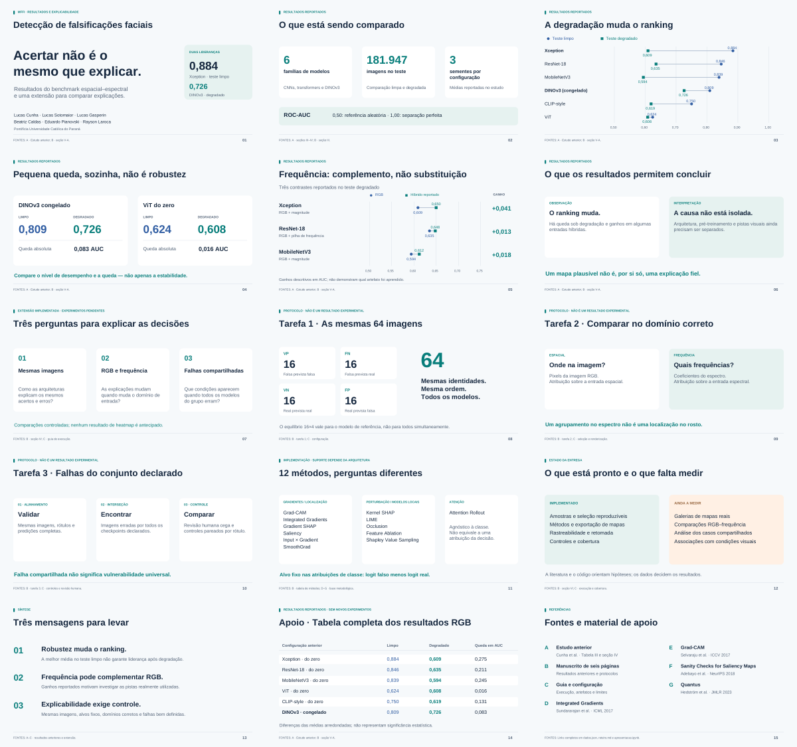

# Apresentação — resultados e explicabilidade

Material em **português brasileiro**, com 15 slides em formato 16:9. Os gráficos usam as médias do estudo anterior citadas no manuscrito de seis páginas. A segunda parte apresenta os três protocolos de explicabilidade como uma extensão implementada, ainda sem novos resultados de imagem.



## Abrir

| Arquivo | Uso |
| --- | --- |
| [apresentacao.pptx](apresentacao.pptx) | PowerPoint editável, com notas do apresentador e fontes em cada slide |
| [apresentacao.pdf](apresentacao.pdf) | Versão pronta para apresentar ou compartilhar |
| [apresentacao.html](apresentacao.html) | Slides no navegador, sem internet; use as setas ou os botões |
| [apresentacao.ipynb](apresentacao.ipynb) | Notebook de apoio, executado somente com as médias publicadas |
| [roteiro.md](roteiro.md) | Notas de fala, interpretação e referências por slide |
| [dados.json](dados.json) | Dados numéricos, metadados e fontes vinculadas a um commit |

O nome correto do formato Jupyter é `.ipynb`. O notebook não exige GPU, imagens nem pesos dos modelos. Seus resultados são tabelas, diferenças aritméticas e gráficos das médias já reportadas — não novas medições dos detectores.

## Roteiro

1. Contexto e pergunta de pesquisa.
2. O que o benchmark compara.
3. Como a degradação muda o ranking RGB.
4. Por que a menor queda não basta para definir robustez.
5. Exemplos de ganhos com representações híbridas.
6. Limite entre observação e explicação causal.
7. Visão geral das três perguntas de explicabilidade.
8. Tarefa 1: mesmas 64 imagens, quatro estratos do modelo de referência.
9. Tarefa 2: RGB e frequência em suas coordenadas nativas.
10. Tarefa 3: falhas compartilhadas do conjunto declarado e controles.
11. Métodos, diferenças de interpretação e suporte.
12. Implementação entregue versus evidência ainda a medir.
13. Síntese.
14. Tabela numérica de apoio.
15. Fontes.

## Gerar novamente

Use um ambiente separado do benchmark, com Python 3.11. No Ubuntu, a geração do PDF utiliza Liberation Sans, instalada por `fonts-liberation` ou `fonts-liberation2`. Nenhum arquivo de fonte é incluído na entrega.

```bash
python -m venv .venv-presentation
. .venv-presentation/bin/activate
pip install -r presentation/requirements.txt
python presentation/build.py
```

O comando gera os arquivos desta pasta e executa o notebook por até 60 segundos por célula. Não baixa datasets, não carrega checkpoints, não treina modelos e não executa o pipeline de XAI. O notebook também pode ser aberto pela raiz do repositório ou pela própria pasta `presentation`.

O PowerPoint contém texto e formas editáveis. A fonte lógica é Arial; o PDF usa a equivalente métrica Liberation Sans. A versão HTML é independente de bibliotecas externas, tem navegação por teclado, foco visível e impressão em 16:9. PDF e HTML são as referências visuais quando o programa de apresentação substitui fontes.

## Leitura dos gráficos

As médias vêm de `paper/original-sibgrapi.pdf` e da seção V-A de `paper/six-page/main.tex`, fixadas no commit informado em `dados.json`. Não devem ser misturadas com o release fine-tuned mais recente. As diferenças são subtrações de médias arredondadas e estão em **unidades de ROC-AUC**, não em pontos percentuais de acurácia. Não foram construídos intervalos nem presumida significância.

Os dois gráficos usam posições, não comprimentos de barras: eixo explícito de 0,50 a 1,00 na comparação limpa/degradada, e de 0,50 a 0,75 nos três contrastes híbridos. Círculos azuis e quadrados verdes têm rótulos textuais, de modo que cor não é o único identificador. Não são exibidos mapas de ativação fictícios. A matriz 16×4 representa o protocolo de amostragem, não uma medição populacional.

## Verificação e rastreabilidade

`build.json` registra os hashes dos arquivos, das fontes de geração e dos dados. A geração verifica 15 slides no PPTX e no PDF, conteúdo textual dentro das páginas, ausência de sobreposição entre textos, execução do notebook sem erros e as diferenças numéricas utilizadas. Imagens de prévia de cada página são disponibilizadas como artefato de CI para revisão visual; `visao-geral.png` reúne as miniaturas.

O fluxo de publicação é limitado à branch `explicability`; só pode versionar os arquivos gerados listados sob `presentation/`, sem force-push. Ele não altera `paper.pdf`, o artigo original, a versão de dez páginas, o código dos modelos, `ICLR` ou `main`. Mudanças desta pasta integram o PR já existente.
