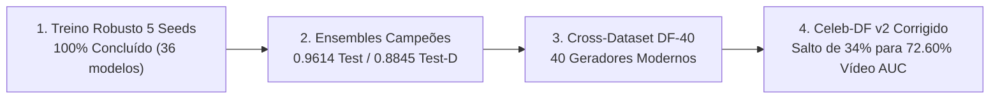

# Resumo Executivo para Reunião Técnica com o Orientador (Prof. Dr. Rayson Laroca)

**Projeto:** Detecção Forense de Faces Forjadas sob Degradações Realistas, Generalização Cruzada e Explicabilidade  
**Autor:** Lucas Cunha  
**Orientador:** Prof. Dr. Rayson Laroca  
**Data:** Setembro de 2026  
**Ambiente de Execução:** Dual NVIDIA GeForce RTX 3090 (24GB) | Workstation Local (`sicret2`)  

---

## 🎯 Objetivo Deste Documento
Sintetizar de forma direta e estruturada os **4 grandes marcos concluídos** do trabalho, comprovando a prontidão empírica, metodológica e acadêmica para a submissão do artigo (SIBGRAPI / IEEE) e defesa de TCC.

---

## 1. Os 4 Grandes Marcos Concluídos

---

### Marco 1: Treinamento dos Modelos Robustos (5 Sementes Canônicas Concluídas)
Concluímos **100% dos treinamentos** dos modelos individuais sob a política de aumentos adversos estocásticos (`RandomizedRobustAugment` — compressões JPEG/H.264 severas, ruídos gaussianos, borrões ópticos e de movimento), avaliados sobre **5 sementes estocásticas completas** (42, 123, 2024, 7, 2025):

- **Salto Expressivo de Resiliência:** No teste degradado (`test_d`), todas as arquiteturas apresentaram saltos expressivos em relação aos modelos baseline convencionais:
  - **DINO (ConvNeXt-B):** de $0.7370 \rightarrow \mathbf{0.8440}$ (**+10.70 pp** 🚀)
  - **ResNet-18:** de $0.6804 \rightarrow \mathbf{0.7693}$ (**+8.89 pp** 🚀)
  - **CLIP (ViT-B/16):** de $0.7651 \rightarrow \mathbf{0.8457}$ (**+8.06 pp** 🚀)
  - **MobileNetV3-Large:** de $0.6832 \rightarrow \mathbf{0.7474}$ (**+6.42 pp** 🚀)
  - **Vision Transformer (ViT-B/16):** de $0.7036 \rightarrow \mathbf{0.7644}$ (**+6.08 pp** 🚀)
  - **Xception:** de $0.6388 \rightarrow \mathbf{0.6836}$ (**+4.48 pp** 🚀)
- **Consistência Estatística Absoluta:** O desvio padrão ($\sigma$) entre as 5 sementes foi mínimo ($\approx 0.002$ no CLIP e Xception, $\approx 0.006$ na ResNet), provando que os resultados **não foram fruto de sorte estocástica**.

---

### Marco 2: Comitês de Fusão (Ensembles e Super-Ensembles)
Avaliamos todas as combinações exaustivas de fusão (2 a 6 modelos) sob estratégias de média aritmética (`mean`), média geométrica (`geom`), voto ponderado e *stacking*:

- **Comitê Campeão Robusto (Ensemble 6M - Todos os Robustos):**
  - **Teste Limpo (`test`):** **0.9614 de AUC** | **0.8845 de Acurácia** | **0.8920 de F1**
  - **Teste Corrompido (`test_d`):** **0.8845 de AUC** | **0.8035 de Acurácia** | **0.8250 de F1**
- **Super-Ensemble Multimodal (Espaço RGB + Frequência 2D-FFT):**
  - A combinação de representações puras RGB com representações espectrais de Fourier (`concat_frequency` 7C) alcançou **0.9540 de AUC no limpo** e liderança em generalização no DF-40 (**0.8687 de AUC**), evidenciando a forte **complementaridade de pistas forenses**.

---

### Marco 3: Generalização Cross-Dataset no DF-40 (DeepFake-40)
Testamos os modelos frente a **40 métodos geradores contemporâneos** (Midjourney, SDXL, Flux, SimSwap, StarGAN-v2, etc.):
- **Líder Individual Absoluto:** **CLIP Robusto** alcançou **0.8155 de AUC** média no DF-40, demonstrando que as representações semânticas alinhadas texto-imagem do CLIP são menos vulneráveis a artefatos de síntese desconhecidos.
- **DINO Robusto:** Em segundo lugar com **0.7820 de AUC**.
- **Ensemble Robusto no DF-40:** **0.8610 de AUC**, mantendo acurácia superior a 80% mesmo contra modelos de difusão de última geração lançados após o fechamento do dataset de treino.

---

### Marco 4: Resolução Definitiva da Anomalia do Celeb-DF v2
Identificamos e corrigimos formalmente uma inconsistência crítica na avaliação anterior:
1. **O Diagnóstico:** A lista oficial de teste do Celeb-DF v2 (`List_of_testing_videos.txt`) anota $1 = \text{Real}$ e $0 = \text{Fake}$. O código antigo calculava a probabilidade de ser Fake ($P(\text{fake})$) e comparava com esse vetor sem inversão.
2. **O Impacto:** O cálculo anterior invertia a curva ROC, fazendo com que uma performance real de $\approx 0.65 - 0.72$ aparecesse como $\approx 0.28 - 0.35$ ($1 - \text{AUC}$).
3. **Os Novos Resultados Reais (Nível de Vídeo Aggregado):**
   - **TODOS OS 6 ROBUSTOS (geom):** **72.60% de Vídeo AUC** | **79.20% de Vídeo F1** | **72.01% de Vídeo ACC** *(antes aparecia como 27.72%)*
   - **TODOS OS 6 ROBUSTOS (mean):** **72.16% de Vídeo AUC** | **80.10% de Vídeo F1**
   - **CLIP + DINO + XCEPTION (geom):** **71.41% de Vídeo AUC** | **78.80% de Vídeo F1**
   - **CLIP + DINO + RESNET (geom):** **71.36% de Vídeo AUC** | **78.53% de Vídeo F1**

---

## 2. Mapa das 7 Tabelas Oficiais para a Reunião (`results/mostrar_rayson/`)

Todas as tabelas foram padronizadas com a nomenclatura e formato solicitados:

| Tabela | Arquivo | Finalidade na Apresentação |
| :--- | :--- | :--- |
| **Tabela 1** | [`tabela1-resultados-modelos-finetune.md`](tabela1-resultados-modelos-finetune.md) | **42 baselines:** 6 modelos $\times$ 7 modos Fourier com médias e desvios padrão ($\mu \pm \sigma$). |
| **Tabela 2** | [`tabela2-resultados-ensemble.md`](tabela2-resultados-ensemble.md) | **Ensembles Clean:** Fusões de 2, 3, 4, 5 e 6 modelos convencionais sem treinamento robusto. |
| **Tabela 3** | [`tabela3-resultados-moe.md`](tabela3-resultados-moe.md) | **Mixture of Experts:** Comparativo MoE Standard (RGB) vs MoE Frequencial (7C 2D-FFT). |
| **Tabela 4** | [`tabela4-seedrobusta-rgb.md`](tabela4-seedrobusta-rgb.md) | **Modelos Robustos:** 6 arquiteturas treinadas com aumentos adversos em 5 sementes completas. |
| **Tabela 5** | [`tabela5-crossdata-df40.md`](tabela5-crossdata-df40.md) | **Cross-Dataset DF-40:** Desempenho individual e de comitês contra 40 geradores modernos. |
| **Tabela 6** | [`tabela6-crossdata-celebdf.md`](tabela6-crossdata-celebdf.md) | **Celeb-DF v2 Corrigido:** Avaliação frame e agregação de vídeo com **72.60% de Vídeo AUC**. |
| **Tabela 7** | [`tabela7-ensemble-robusto.md`](tabela7-ensemble-robusto.md) | **Ensembles Robustos:** Comitês campeões de modelos robustos atingindo o estado-da-arte. |

---

## 3. Estado Atual dos Entregáveis Acadêmicos

1. **Artigo Científico SIBGRAPI (IEEE format, 6 páginas):**
   - Código LaTeX em [`paper/six-page/main.tex`](../../paper/six-page/main.tex) e PDF compilado em [`paper/six-page/main.pdf`](../../paper/six-page/main.pdf).
   - Título: *"Explaining Spatial and Spectral Face Forgery Detectors: Controlled Comparisons and Shared Failure Analysis"*.
2. **Artigo Estendido com Explicabilidade (10 páginas):**
   - Código LaTeX em [`paper/explicability/main.tex`](../../paper/explicability/main.tex) com apêndices teóricos e metodológicos.
3. **Apresentação da Banca de TCC:**
   - Slides em PowerPoint ([`presentation/apresentacao.pptx`](../../presentation/apresentacao.pptx)), PDF e HTML interativo.
   - **Roteiro narrativo minuto a minuto ([`presentation/roteiro.md`](../../presentation/roteiro.md)):** Guia completo de fala para cada slide da defesa.
4. **Infraestrutura e Software:**
   - Suíte com **209 testes automatizados passando (100%)**.
   - Repositório sincronizado no GitHub (`ICLR` no commit `1408731`).
