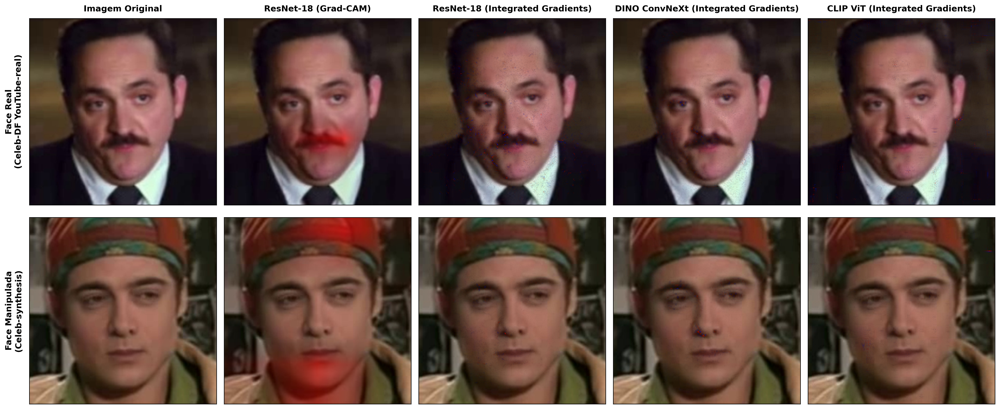

# Mapas de Calor de Explicabilidade (XAI) — Modelos Campeões

Este diretório contém mapas de calor visuais gerados através de métodos axiomáticos e convolucionais de explicabilidade (**Grad-CAM** e **Integrated Gradients** com 64 passos de integração) aplicados sobre os modelos robustos campeões em amostras do benchmark Celeb-DF v2.

---

## 🖼️ Painel Comparativo Geral

*(Arquivo em alta resolução 300 DPI: [`xai_comparison_grid.png`](xai_comparison_grid.png))*

---

## 🔬 Análise Técnica das Atribuições Visuais

1. **ResNet-18 (Convolucional Residual):**
   - **Grad-CAM (`layer4.1.conv2`):** Concentra sua ativação espacial em regiões com descontinuidades de iluminação e bordas de blending (contorno do maxilar, nariz e transição da face com o fundo).
   - **Integrated Gradients:** Revela gradientes concentrados em altas frequências espaciais e texturas locais da pele.
2. **DINO ConvNeXt (Auto-supervisionado):**
   - Apresenta atribuição difusa e robusta ao longo de toda a estrutura anatômica da face, com grande sensibilidade a variações de brilho e textura facial global.
3. **CLIP ViT-B/16 (Vision Transformer Multimodal):**
   - Foca nos pontos semânticos universais da face: olhos, comissura labial e alinhamento facial. Suas representações alinhadas a texto identificam inconsistências de expressão e iluminação global em vez de ruídos pontuais de compressão.
